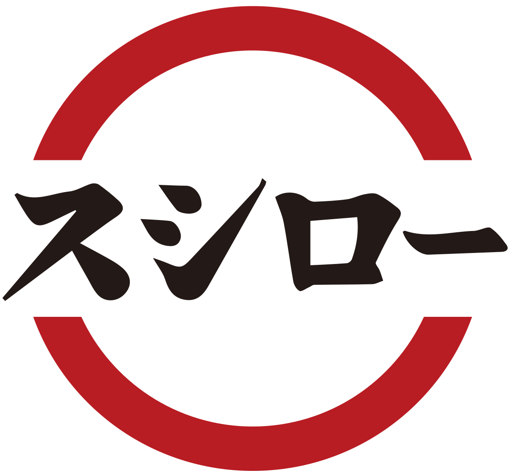

# 壽司郎香港 店舗メンテナンス管理システム
## Sushiro Hong Kong - Store Maintenance Management System

<p align="center">
  
</p>

## 🎯 プロジェクト概要

FOOD & LIFE COMPANIES（あきんどスシロー）のDX戦略に基づき、香港全40店舗のメンテナンス業務を一元管理するプラットフォームです。

### コンセプト

> 「社外パートナーと情報共有可能とするプラットフォームの構築」
> 「店舗オペレーションの最適化・自動化」

これらの経営方針に則り、店舗と設備業者間のコミュニケーションをデジタル化し、業務効率化とコスト削減を実現します。

---

## 📊 システム構成

### 対象店舗
- **香港全域 40店舗**
  - 新界エリア: 20店舗
  - 九龍エリア: 16店舗
  - 香港島エリア: 4店舗

### 連携業者
| 業者名 | 担当分野 |
|--------|----------|
| LIFESUPPORT (HK) LIMITED | 総合設備メンテナンス |
| Fujimak | 厨房機器メンテナンス |

---

## 🚀 主要機能

### 1. 店舗スタッフ向け機能
- **メンテナンスコール**: 6ステップで簡単に修理依頼
  1. エリア選択（全域/店外/厨房/配膳間/洗手間/員工室）
  2. 項目選択（43種類のメンテナンス項目）
  3. 緊急度選択（緊急/普通/見積もり）
  4. 詳細入力（写真添付対応）
  5. スケジュール選択（カレンダー＋時間指定）
  6. 確認・送信

- **リクエスト履歴**: 過去の依頼状況を一覧表示
- **通知機能**: 業者からの日程変更提案を受信・承認

### 2. 管理者向け機能
- **全店舗ダッシュボード**: 40店舗のメンテナンス状況を一元管理
- **ガントチャートカレンダー**: 2週間〜無限スクロールで進捗確認
- **ステータスフィルター**: 待機中/進行中/完了で絞り込み

### 3. 多言語対応
- 🇯🇵 日本語
- 🇭🇰 繁體中文
- 🇬🇧 English

---

## 💡 期待される効果

### 業務効率化
| Before | After |
|--------|-------|
| 各店舗が個別に業者へ電話連絡 | アプリから統一フォーマットで依頼 |
| メンテナンス状況が店舗ごとに分散 | 管理画面で全店舗を一元管理 |
| 紙ベースでの記録・報告 | デジタルで履歴管理・検索可能 |

### コスト削減
- 連絡調整工数の削減
- 重複発注の防止
- 緊急対応の最適化

---

## 🛠 技術スタック

| カテゴリ | 技術 |
|----------|------|
| フレームワーク | Next.js 16 (App Router) |
| 言語 | TypeScript |
| スタイリング | Tailwind CSS |
| 国際化 | next-intl |
| データベース | Supabase (PostgreSQL) |
| ホスティング | Vercel |
| 日付処理 | date-fns |

---

## 📁 プロジェクト構成

```
sushiro-maintenance/
├── src/
│   ├── app/
│   │   ├── page.tsx          # スプラッシュ画面
│   │   ├── stores/           # 店舗選択
│   │   ├── dashboard/        # ダッシュボード
│   │   ├── maintenance/      # メンテナンスコール
│   │   ├── history/          # リクエスト履歴
│   │   ├── notifications/    # 通知画面
│   │   ├── management/       # 管理者画面
│   │   └── settings/         # 設定
│   ├── components/
│   │   ├── Header.tsx        # ヘッダー（言語切替含む）
│   │   └── BottomNav.tsx     # フッターナビ
│   └── lib/
│       └── constants.ts      # マスターデータ
├── messages/
│   ├── ja.json               # 日本語翻訳
│   ├── zh.json               # 繁體中文翻訳
│   └── en.json               # English翻訳
└── public/
    └── data/
        ├── maintenance_categories.csv
        ├── maintenance_items.csv
        └── urgency_levels.csv
```

---

## 📱 画面一覧

| 画面 | 説明 | URL |
|------|------|-----|
| スプラッシュ | 起動画面 | `/` |
| 店舗選択 | 地区別店舗選択 | `/stores` |
| ダッシュボード | 店舗ホーム画面 | `/dashboard` |
| メンテナンスコール | 修理依頼フォーム | `/maintenance` |
| リクエスト履歴 | 過去の依頼一覧 | `/history` |
| 通知 | 業者からの通知 | `/notifications` |
| 管理者画面 | 全店舗管理 | `/management` |
| 設定 | 言語・業者設定 | `/settings` |

---

## 🔧 開発環境セットアップ

```bash
# 依存関係インストール
npm install

# 開発サーバー起動
npm run dev

# ビルド
npm run build

# 本番デプロイ
npx vercel --prod
```

---

## 🎬 営業プロモ動画（Remotion）

16:9・約120秒・繁體中文テキストの営業用プロモ動画を Remotion で制作・レンダリングできます。

**動画を「見る」手順（このリポジトリのルートで）:**

1. **プレビューで見る**（ブラウザでタイムライン操作）  
   ```bash
   cd sushiro-maintenance && npm run remotion:preview
   ```  
   起動後、ブラウザが開いたら「PromoZh」を選んで再生。

2. **短いサンプルをすぐファイルで見る**（約40秒・軽いレンダー）  
   ```bash
   cd sushiro-maintenance && npm run remotion:short
   ```  
   完了後、**`sushiro-maintenance/out/promo-zh-short.mp4`** をダブルクリックで再生。

3. **フル尺の MP4 を出力する**（約120秒・数分かかります）  
   ```bash
   cd sushiro-maintenance && npm run remotion:render
   ```  
   完了後、**`sushiro-maintenance/out/promo-zh.mp4`** を再生。

- **構成**: `remotion/`（Root・PromoZh・各 Scene・3D 部品・コピー）

---

## 🌐 本番環境

**URL**: https://sushiro-maintenance.vercel.app

---

## 📅 導入スケジュール（案）

### Phase 1: パイロット導入（1-2ヶ月）
- 対象: 5店舗（新界エリア選抜）
- 目的: システム検証・フィードバック収集

### Phase 2: 全店展開（2-3ヶ月）
- 対象: 香港全40店舗
- 目的: 本格運用開始

---

## 📞 お問い合わせ

**開発・運営**: LIFESUPPORT (HK) LIMITED

---

© 2026 LIFESUPPORT (HK) LIMITED. All Rights Reserved.
